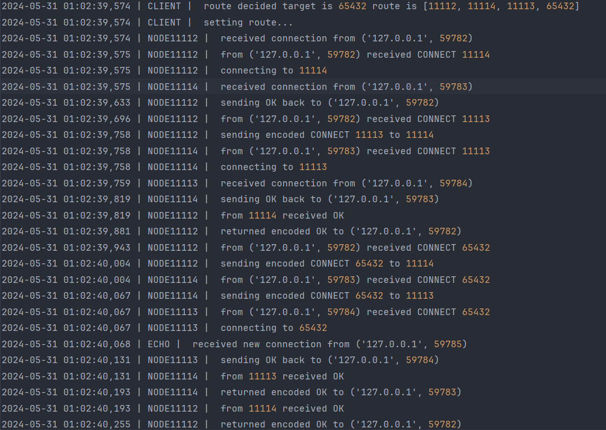
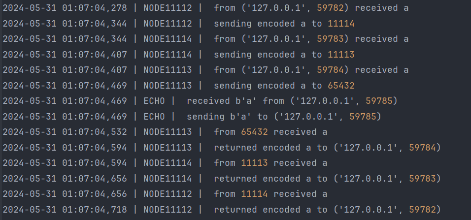
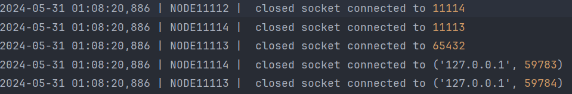
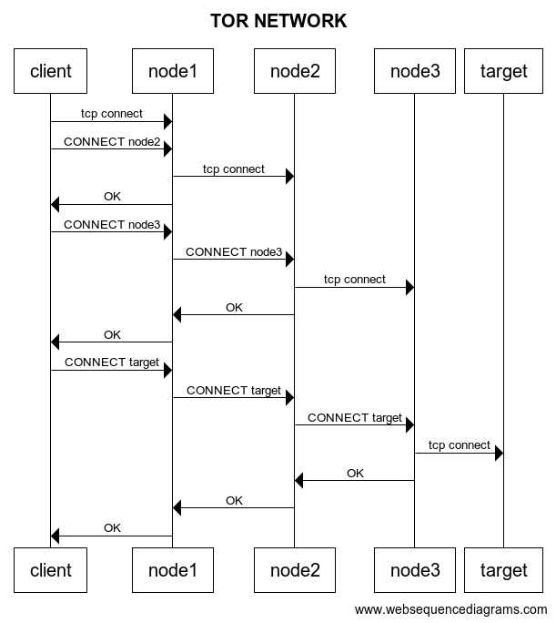

# Tor Network Project

A project to set up and run a kinda Tor Network on localhost.
the main idea is about simulating the same concept as a Tor Network but only on the pc's local host 
is uses each port as a different type of device required for the Tor Network

## how to setup:
#### 1.run directory.py 
#### 2.open the run_nodes.bat file
#### 3.run Echo server
#### 4.run Client and enter Echo server's ports
#### 5.have fun

## here are some pictures:

### creating connection 

### sending data 

### closing connection 

### sequence diagram:

